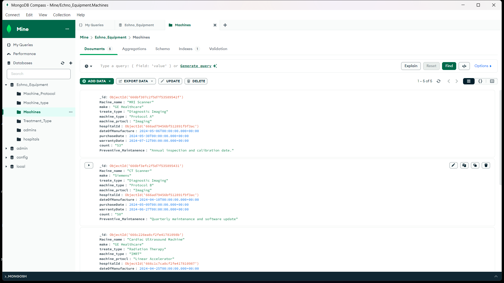

# Integrated Hospital Equipment Care System

## Project Overview

The Integrated Hospital Equipment Care System is designed to manage the preventive maintenance of hospital machines and equipment, ensuring their optimal functioning to enhance patient care and hospital operations. This system is a part of a larger hospital management framework.

## Features

- **Preventive Maintenance**:Tracking of maintenance tasks.
- **User Roles**: Different access levels for administrators, managers, and technicians.

## Technology Stack

- **Frontend**: React
- **Backend**: Node.js, Express.js
- **Database**: MongoDB

## Installation

1. **Clone the repository**
    ```sh
    git clone https://github.com/your-username/integrated-hospital-equipment-care-system.git
    cd integrated-hospital-equipment-care-system
    ```

2. **Install dependencies for the backend**
    ```sh
    cd backend
    npm install
    ```

3. **Install dependencies for the frontend**
    ```sh
    cd ../frontend
    npm install
    ```

4. **Set up environment variables**

    Create a `.env` file in the backend directory with the following content:
    ```plaintext
    PORT=5000
    MONGODB_URI=your_mongodb_connection_string
    ```

5. **Run the backend server**
    ```sh
    cd backend
    npm start
    ```

6. **Run the frontend development server**
    ```sh
    cd ../frontend
    npm start
    ```

## Usage

1. **Access the Application**
    Open your web browser and navigate to `http://localhost:3000`.

2. **Log in with appropriate credentials**
    - Admin
    - Manager
    - Physist

3. **Navigate through the dashboard**
    - View upcoming maintenance tasks
    - Monitor equipment status
    - Generate and view reports

## **Screenshots**

<br>

1.**Login Page**

<br>
  
  <br>
  
2.**Admin Dashboard**

<br>
  

3.**Machines Add Page**

<br>
  

<br>

4.**Physist Dashboard**

<br>
  

<br>

5.**Database**

<br>
  

<br>


## Authors
- [**ShriraamMKS**](https://github.com/Shriraam-6219)
- [**VigneshwaranB**](https://github.com/VigneshwaranB)
- [**VijayBharathV**](https://github.com/vigneshwaranbalamurugan)

## Acknowledgements

This project was developed as part of the Web Technology Laboratory course at Kongu Engineering College.
